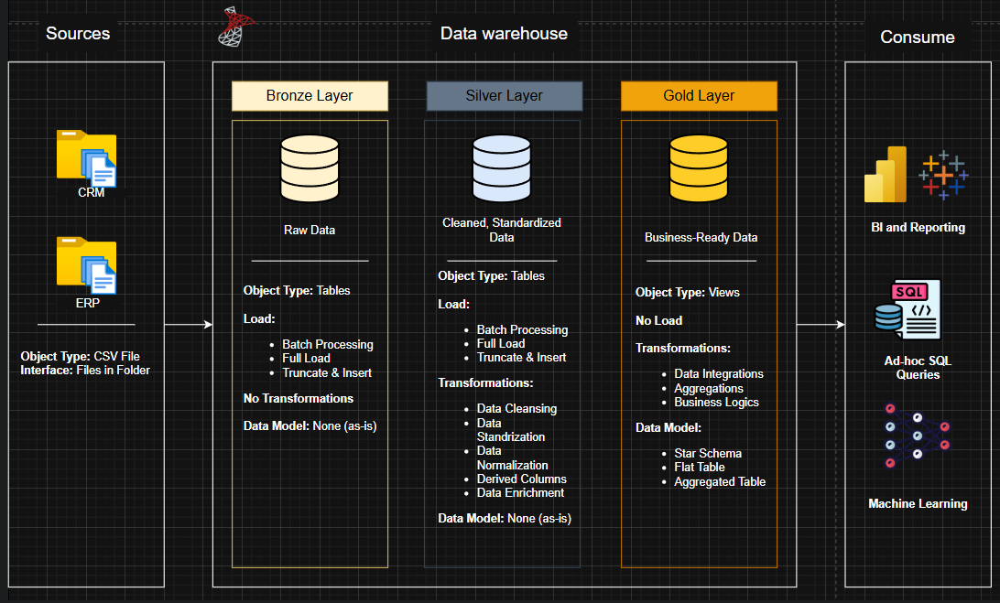

# 🏭 SQL Data Warehouse Project – Retail & ERP Analytics (Retail & ERP Industry)

## 📌 Executive Summary

**Business Problem:**
In the **Retail & ERP industry**, critical data is often trapped in separate systems like **CRM** (customer records) and **ERP** (product/inventory/operations), leading to **data silos** and inconsistent reporting.

**Solution:**
This project demonstrates the creation of a **SQL-based Data Warehouse** using the **Medallion Architecture (Bronze, Silver, Gold layers)**. It consolidates raw CRM & ERP datasets through structured **ETL pipelines** and organizes the final data into a **Star Schema** model, creating a **single source of truth** for analytics.

**Impact (Learning Outcomes):**

* Created an **integrated warehouse** combining disparate CRM & ERP data.
* Gained **hands-on experience** in complex SQL transformations and ETL pipeline design.
* Designed a **scalable star schema** to enable quick, efficient reporting and BI dashboarding.

---

## 🔎 Business Problem

Businesses face common, crippling challenges when CRM and ERP systems remain disconnected:

* **Data Silos:** Information is scattered, making it impossible to get a holistic view of the business.
* **Inconsistent Records:** Duplicate and conflicting customer and product details lead to inaccurate metrics.
* **Manual Reporting:** Analysts waste time manually cleaning, merging, and standardizing data, leading to slow and error-prone decision-making.
* **Slow Decision-Making:** Leaders lack quick access to reliable, aggregated insights.

📊 **Without this data warehouse, it is difficult to answer mission-critical questions such as:**

* *“How do we segment customers into categories (VIP, Regular, New) based on their **Average Monthly Spend** and **Recency**?”*
* *“Which product categories should we prioritize based on revenue and how do we segment them into **High-Performers vs. Low-Performers**?”*
* *“What is the **Lifespan** (in months) of our key products and customers, and how has their performance changed **over time**?”*

---

## ⚙️ Methodology

The project's design and implementation followed the industry-standard **Medallion Architecture**, progressing the data through three distinct layers.

### 1. Data Ingestion (Bronze Layer)
This is the raw data layer. We loaded all source **CRM & ERP CSV datasets** directly into SQL Server, preserving the original, unaltered structure and data types.

### 2. Data Transformation (Silver Layer)
This layer focuses on quality and standardization. We applied complex SQL logic for:
* **Cleaning:** Handling nulls and correcting data types.
* **Deduplication:** Identifying and removing duplicate customer and product records.
* **Normalization:** Standardizing attributes (e.g., date formats, marital status values).
* **Integration:** Preparing keys for merging CRM and ERP entities.

### 3. Data Modeling (Gold Layer)
This is the final, consumption-ready layer. We organized the transformed data into a **Star Schema** structure, optimized for fast querying and BI tool performance.

👉 **Overall Data Architecture (Bronze → Silver → Gold Flow):**


👉 **Star Schema Model (Gold Layer):**
This model is built around the central **gold.fact\_sales** table, linked by foreign keys to **gold.dim\_customers** and **gold.dim\_products**.


---

## 🛠️ Skills & Technologies

* **Data Engineering:** Medallion Architecture (Bronze, Silver, Gold), **ETL Pipeline Design**.
* **SQL Development:** **Advanced Joins**, **Stored Procedures**, Views, **Data Definition Language (DDL)**.
* **Data Modeling:** **Star Schema design**, Fact & Dimension identification, Surrogate Key implementation.
* **Tools Used:** **SQL Server**, **SQL Server Management Studio (SSMS)**, Draw.io (for diagrams).

---

## 📊 Results and Business Recommendations

✅ **Results:**

* Successfully built an operational **SQL data warehouse** integrating key datasets from separate source systems (CRM & ERP).
* Final data is structured into robust, analytical tables: **Fact\_Sales**, **Dim\_Customers**, and **Dim\_Products**.
* The modeled data is validated and **ready for immediate analysis** and dashboard construction.

💡 **Recommendations (for business use):**

* **Adopt the Warehouse:** Use the Gold Layer tables as the **single source of truth** for all sales, customer, and product reporting.
* **Develop BI Dashboards:** Create dashboards for key areas, including customer segmentation, sales forecasting, and product performance analysis.
* **Apply Data Governance:** Establish procedures to monitor and ensure the continued consistency and quality of data flowing into the Bronze layer.

---

## 🔮 Next Steps

This project focused on the foundational data warehouse building. Future extensions were planned, and the following steps have been **completed in a separate repository**:  

1. **Exploratory Data Analysis (EDA) & Foundational Analytics:** Conducted in-depth analysis focusing on **time series**, **ranking**, and **magnitude** analysis. Calculated crucial KPIs such as **Recency**, **Average Order Value (AOV)**, **Average Monthly Spend**, and **Lifespan** for both customer and product entities.  

2. **Advanced Business Analytics & Segmentation:** Implemented sophisticated reporting logic using **data segmentation** and **part-to-whole analysis** to create high-value business insights. This included:  
   * **Customer Segmentation:** Categorizing customers (e.g., VIP, Regular, New) based on behavior and value.  
   * **Product Performance Grouping:** Identifying product groups (e.g., High-Performers, Low-Performers) based on sales and quantity metrics.  

   > **🔗 Note:** Both steps are completed in a separate repository: [SQL Data Analytics Project](https://github.com/PranavAdhau/sql-data-analytics-project)

3. **BI Dashboarding:** Implement analytical dashboards using tools like Power BI or Tableau to visualize KPIs and customer/product segments.  

4. **Data Source Expansion:** Incorporate additional data sources, such as **Finance & Marketing datasets**, to build a more comprehensive enterprise data model.

---

## 📂 Repository Structure
``` bash
sql-data-warehouse-project/
│
├── datasets/             # Raw source files from ERP and CRM systems
│   ├── source_crm/       
│   └── source_erp/       
│
├── docs/                 # Documentation, architectural diagrams, and metadata
│   ├── DataArchitecture.png
│   ├── DataModel_StarSchema.png
│   ├── data_catalog.md
│   └── naming_conventions.md
│
├── scripts/              # SQL scripts for database setup and ETL logic
│   ├── bronze/           # Ingestion scripts
│   ├── silver/           # Transformation and cleaning scripts
│   └── gold/             # Final modeling scripts (Fact/Dim tables)
│
├── tests/                # Data quality and validation checks (e.g., dbt tests)
├── README.md             # Project overview and usage instructions
└── LICENSE               # License details
```

---

## 🛡️ License

This project is licensed under the [MIT License](LICENSE).
